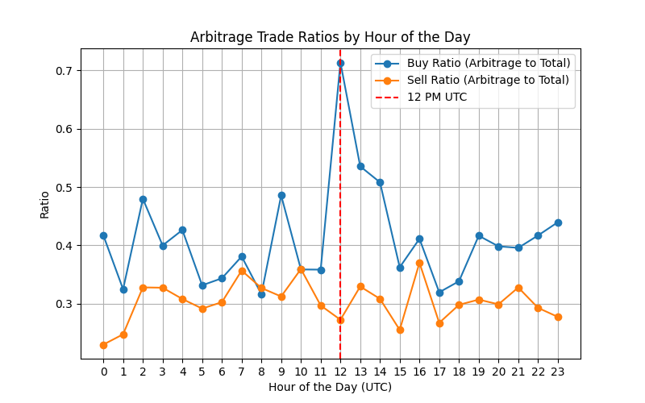
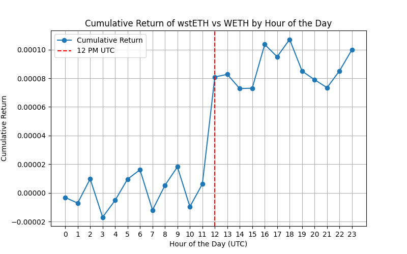

## Rebasing LST arbs and predictable price effects

This project studies arbing of wstETH/wETH 1 bps pool and the price effects of daily rebasing of stETH at 12pm UTC.

Arb trades are identified as those performed by the top 10 most active swapper address in the pool.

### Key Results

1. Arbs follow predictable patterns of buying wstETH vs wETH around rebasing time, presumably so that they can unwrap at Lido at a better price.

2. Price of wstETH vs wETH jumps up every day around 12pm UTC as a result of such predictable arb flow.

